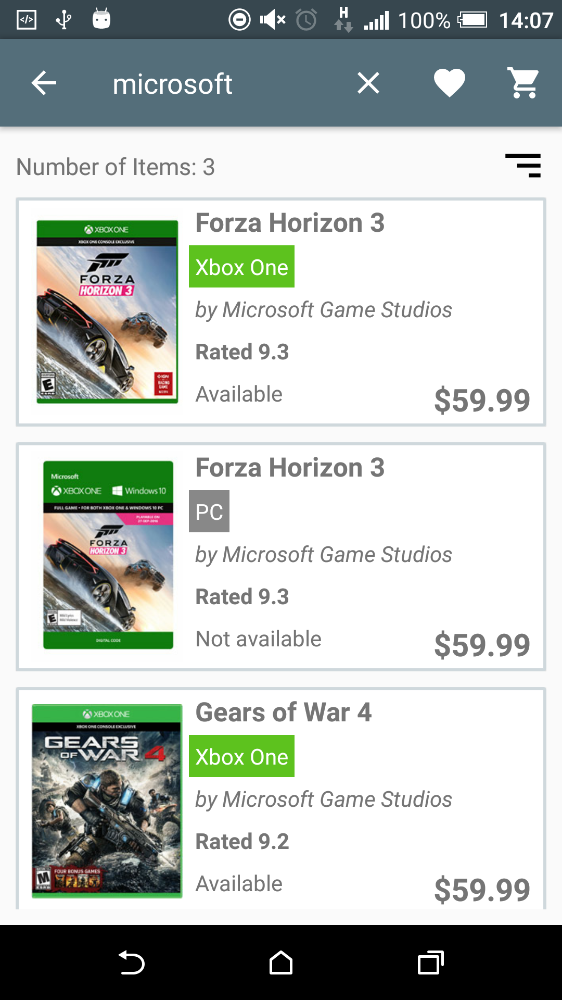

### Project #2: Gameshop

## Overview

Gameshop is an app which can be used to buy PS4, Xbox One and PC games.

Upon launching the app; all possible items in the database are shown to the user. The user can make a search within the products by entering the name of the game, the company of the game or the platform of the game. The user can also sort the results by clicking on the sort icon.

Upon clicking an item the user is shown the detail screen of the game. In this screen the user can choose to add/remote an item to his wish list or add an item to his cart.

On the wish list screen; the user can see the games which he labelled as favorites and may remove any of them by swiping them either right or left.

On the cart screen; the user can see the games which he added to the cart and may remove any of them by swiping them either right or left. He can also check out to buy the products by clicking a FAB.

## Screenshots:

   

   

  

# Paper Prototyping images can be found on in the folder “paper_prototypes”

# Known issues:
 - The espresso test fails on some cases.

---

## Licensing
1. All content is licensed under a CC­BY­NC­SA 4.0 license.
2. All software code is licensed under GNU GPLv3. For commercial use or alternative licensing, please contact [legal@ga.co](mailto:legal@ga.co).
